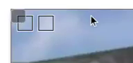

# P~~oké~~hotoSnap

Uma ferramenta para marcar suas fotos! Baixe o [código seminal][seminal].


[seminal]: https://github.com/fegemo/cefet-front-end-snap/archive/main.zip


## Atividade

Você deve modificar a página para que ela mostre duas marcações
(~~pokémons~~) na imagem (~~foto~~). Cada marcação é definida por um
quadrado e possui um título e um conteúdo, que devem ser exibidos em
um balãozinho quando o usuário passar o mouse sobre cada uma.


### Exercício 1: Alterar/remover conteúdo do balãozinho


Crie um código JavaScript (_e.g._, `balaozinho.js`) que, para cada região
anotada (`.marcacao`, cada quadradinho dentro da imagem), define o
conteúdo do elemento `#balaozinho` (lembre-se
[como definir o conteúdo de um elemento HTML][inner-html]) com uma
string qualquer.

Você deve atrelar os devidos eventos de mouse **a cada¹** `.marcacao`
para que (relembre os [eventos de mouse][eventos-de-mouse]):

1. quando o **mouse entrar no quadradinho**, definir o conteúdo do
   `#balaozinho` como uma string qualquer
2. quando o **mouse sair do quadradinho**, definir o conteúdo como
   uma string vazia

Se acontecer do _balãozinho ficar "piscando"_ ao mexer o mouse, veja o [FAQ](#faq)
sobre como consertar.


¹ No momento existem duas `.marcacao`s, mas pode ser que existam muitas
outras, ou até nenhuma. Lembre-se de como
[selecionar vários elementos do DOM][selecionar-varios]. Você fez isso na
prática da exploração espacial. Lembre-se também de como 
[associar eventos a elementos HTML][associar-eventos].


### Exercício 2: Formatação do balãozinho


Este é um **exercício de CSS** mesmo (não precisa fazer em JavaScript). Estilize o `#balaozinho` para que ele se pareça com um balãozinho mesmo.
Sugestões:

- Tamanho de fonte menor (tipo `10px`)
- Cor de fundo semitransparente
- Bordinha marota
- Um espacinho interno (`padding`)
- Cantinho levemente arredondado
- Uma sombra sinistra (veja [FAQ](#faq))

Além disso, altere o pointeiro do mouse quando ele estiver 
em uma `.marcacao`. Isso pode ser feito em 
**uma regra que estiliza `.marcacao`** e define a propriedade 
`cursor` como `help` (interrogação) ou `pointer` (mãozinha).


### Exercício 3: Definir título/conteúdo correto do balãozinho


Agora, você deve substituir a "string qualquer" com um trecho HTML que
contenha o título e o conteúdo da marcação, tipo assim:

```html
<div id="balaozinho">  
  <h2>título da anotação</h2>
  <p>conteúdo da anotação</p>
</div>
```

> **Você sabia??** É possível colocar elementos HTML dentro de uma string que
> estamos atribuindo ao `innerHTML` de um elemento, tipo assim:

> ~~~js
> algumEl.innerHTML = '<span>abc</span><div>def</div>';
> ~~~

Mas como saber qual das duas `.marcacao` passamos o mouse em cima?
Basta pegar qual elemento foi **alvo do evento** (`mouseover`). Para
isso, lembre-se do [argumento de evento][argumento-de-evento] (vimos
na aula da exploração espacial para saber qual dos botões dos parágrafos
havia sido clicado).


Cada `.marcacao` é uma `<div></div>` devidamente estilizada e ela
está assim:

```html
<div class="marcacao"
  data-titulo="Electrode"
  data-conteudo="Este é uma pseudo-pokébola invertida"
  style="width: 20px; height: 20px; top: 10px; left: 40px;"></div>
```

Elas possuem dois atributos "personalizados" (nome certo é "atributos de dados"):
um deles chama `data-titulo="..."` e armazena o título
daquela marcação e o outro chama `data-conteudo="..."` e armazena o 
texto que deve ir dentro do parágrafo do balãozinho.

Na verdade, nós podemos usar atributos que não existem no HTML para
nossos próprios propósitos. Basta colocar `data-novoatributo` em um
elemento (_data_ em inglês = dados em português).

Para acessar o valor desses atributos, usamos uma propriedade `dataset`
do elemento HTML, assim:

```html
<span data-dikentinha="um certo texto">Algum assunto</span>
```
```js
let algumEl = document.querySelector('....');
let dikentinha = algumEl.dataset.dikentinha;
// variável dikentinha contém "um certo texto"
```


### Exercício 4: Posicionamento do balãozinho


Faça com que, quando o mouse se movimente dentro de uma `.marcacao`,
o `#balaozinho` se posicione nas mesmas coordenadas que o mouse. Veja
como [pegar a posição do mouse][posicao-mouse] nos slides. Lembre-se:
será necessário usar o [argumento de evento][argumento-de-evento],
que é um parâmetro das _callbacks_ de evento e contém informações
sobre o que aconteceu.


### Exercício 5: Definição da 1ª marcação


Faça com que o usuário possa definir as propriedades da 1ª marcação
(`left, top, width, height`) a partir dos campos `input` à direita.

Quando o botão for clicado, as propriedades da 1ª marcação devem ser
atualizadas.

Como um mimo para os olhos do usuário, você pode colocar, em CSS, a
propriedade `transition: all 200ms ease` na `.marcacao` para que os
valores alterdos das propriedades façam uma transição suave (fica show).


### Desafio 1: Atualização mais ágil da marcação

Em vez de usar o botão para atualizar as propriedades da marcação,
faça com que assim que o usuário pressionar uma tecla em qualquer dos
`input`s, a região da marcação seja atualizada. Aí você pode até tirar o
botão do HTML.

Isso pode ser feito com o evento `change` (ainda não vimos) que pode ser
associado a um `input`.


### Desafio 2: Definição da marcação sendo editada

Faça com que, em vez de poder alterar apenas a 1ª marcação, o usuário
possa escolher qual delas quer atualizar.

Uma ideia é: (1) ter uma variável global que aponta para a `marcacaoAtualEl`,
(2) colocar eventos de `click` às marcações e, na _callback_ registrada, (3)
atualizar o valor dessa variável para o elemento que foi alvo do evento.

Além disso, se quiser indicar visualmente qual
é a marcação selecionada, faça com que ela (e apenas ela)
tenha a classe `.selecionada`.


### Desafio 3: Escolha da imagem (_hardcore!_ 💣💣💣)

Existe um `<input type="file">` que permite ao usuário escolher um arquivo
de seu computador. Você pode colocar um desses na página e, assim que o
usuário alterar valor desse `input` (evento `change`), seu código altera a
imagem que está sendo anotada.

**Desafio mais difícil**: veja o artigo a seguir e tente identificar um código
nele que faz o que você precisa: deixa usuário escolher um arquivo e
o coloca como uma imagem no lugar da foto dos pokémons.

Referência: https://www.html5rocks.com/en/tutorials/file/dndfiles/


## FAQ


### Balãozinho piscando quando movimento o mouse

Pode acontecer de o balãozinho ficar "piscando" quando você movimenta o
mouse em cima da marcação. Isso acontece porque o navegador entende
que ora o mouse está em cima da marcação, ora ele está em cima do
balãozinho - e isso alterna muitas vezes por segundo.

Uma forma de evitar isso é posicionar o balãozinho a uma certa distância
do mouse, em vez de exatamente na posição dele. Outra forma é falar que
a `<div id="balaozinho">...</div>` não "responde" a eventos de mouse.
É possível fazer isso bem facilmente com uma propriedade CSS no
`#balaozinho`: propriedade `pointer-events` com valor `none`.


### Como altero uma propriedade CSS de um elemento dinamicamente?

Há 2 formas, sendo uma delas colocando e tirando classes, e a outra
[alterando a propriedades CSS diretamente][alterando-estilo-via-js].


### Como fazer sombras em CSS?

Existe a propriedade `box-shadow`. Ela funciona assim:

```css
div {
  box-shadow: 4px 4px 4px silver;
}
```

O primeiro valor é o deslocamento horizontal da sombra (positivo vai para
a direita), o segundo é o vertical (positivo vai para baixo), o terceiro
é o quanto a sombra está "borrada" (para uma borda suave, coloque algo
diferente de `0`) e o quarto é a cor da sombra.

A cor da sombra, tipicamente, colocamos uma cor semitransparente
(_e.g._, `rgba(...., 0.2)`).


### Ficou um quadradinho visível no balãozinho


Se após estilizar o balãozinho (Exercício 2), ao tirar o mouse
de cima de uma marcação, continuar aparecendo um quadradinho
no lugar do balão, é devido ao `padding` (espaçamento interno)
que foi colocado nele.

Para que o balãozinho fique oculto quando estiver vazio, nesse
caso, uma forma é colocar um `balaozinhoEl.style.display = 'none'` no `mouseout` e `...display = 'block'` no `mouseover`.

Ou então, dá pra fazer via CSS também, usando a pseudoclasse 
`:empty`. Ela serve para estilizar elementos quando eles estão
vazios (ou seja, seu `innerHTML === ''`). Então, poderia ser
feito assim:

```css
#balaozinho:empty {
  display: none;
}
```

Obs: fazendo isso, o quadradinho ainda ficará aparecendo quando
a página carrega. Isso acontece porque o `.innerHTML` do balãozinho
não está vazio, porque ele contém um comentário dentro dele.
Nesse caso, basta apagar o comentário e não deixar nenhum espaço
entre a tag de abertura e a de fechamento, assim: `<div id="balaozinho"></div>`.

[inner-html]: https://fegemo.github.io/cefet-front-end/classes/js2/#alterando-o-conteudo
[selecionar-varios]: https://fegemo.github.io/cefet-front-end/classes/js2/#selecionando-varios-elementos
[posicao-mouse]: https://fegemo.github.io/cefet-front-end/classes/js3/#posicao-mouse
[alterando-estilo-via-js]: https://fegemo.github.io/cefet-front-end/classes/js3/#estilizando-elementos-dinamicamente
[associar-eventos]: https://fegemo.github.io/cefet-front-end/classes/js1/#evento-clique
[eventos-de-mouse]: https://fegemo.github.io/cefet-front-end/classes/js3/#eventos-de-mouse
[argumento-de-evento]: https://fegemo.github.io/cefet-front-end/classes/js2/#argumento-de-click